# Vault
Vault is a white-labelled Enterprise Custody Wallet core banking solution in the Bitcoin Standard for traditional banks to upgrade their Infra to offer their Clients different risk profile of Bitcoin Custody


# Overall Architecture 

```mermaid
flowchart TD
%% High-Level Components
    A("User Interface")
    B["Authentication Service"]
    C["Secure Vault Management"]
    D("fa:fa-database Key Storage")
    E["fa:fa-btc Bitcoin Node"]
    F("fa:fa-clipboard File Storage")
    G("fa:fa-network-wired Network Service")
    H["fa:fa-shield-alt Watchtower"]
    I("fa:fa-desktop Monitoring and Logging")
    J("fa:fa-users Admin Panel")
    K("fa:fa-key Multi-Factor Authentication")
    L("fa:fa-spinner Initialization & Setup")
    M("fa:fa-tools Maintenance")
    N("fa:fa-cogs Configuration Management")
    O("fa:fa-lock Role-Based Access Control")
    P("fa:fa-exchange-alt Transaction Coordinator")
    Q("fa:fa-hourglass Job Scheduling")
    R("fa:fa-server Hardware Security Module (HSM)")
    S("fa:fa-user-shield Governance & Policy Engine")
    T("fa:fa-wallet Multisig Management")
    U("fa:fa-edit Multisig Wallet Setup")
    V("fa:fa-share-alt Transaction Builder")
    W("fa:fa-certificate Signature Aggregator")
    X("fa:fa-key Signing Devices")

%% High-Level Edge Connections
    A -->|Authenticate| B
    B -->|Two-Factor| K
    B -->|Validate| O
    O -->|Access| C
    C -->|Coordinate| P
    C -->|Access| D
    C -->|Sync| E
    C -->|Store Files| F
    C -->|Broadcast| G
    C -->|Encrypt| H
    H -->|Secure Channel| C
    D -->|Backup Keys| F
    G -->|Broadcast| E
    E -->|Update| G
    C -->|Log Events| I
    J -->|Manage| C
    K -->|Two-Factor| B
    L -->|Setup Environment| C
    M -->|Update| C
    N -->|Configure| C
    P -->|Coordinate Jobs| Q
    Q -->|Job Execution| C
    S -->|Policy Enforcement| C
    C -->|Manage Secure Keys| R
    C -->|Create Multisig Wallet| U
    U -->|Manage Multisig| T
    T -->|Build Transactions| V
    V -->|Aggregate Signatures| W
    W -->|Sign with Devices| X
    X -->|Verify Signatures| W
    W -->|Send Signed Transaction| V
    V -->|Broadcast| G

%% Detailed Subcomponents of "Secure Vault Management"
    subgraph Secure_Vault_Management
        C["Secure Vault Management"]

        C1["Access Control"]
        C2["Multisig Coordinator"]
        C3["Transaction Manager"]
        C4["Key Manager"]
        C5["Policy Engine"]
        C6["State Manager"]
        C7["Communication Manager"]

        C --> C1
        C --> C2
        C --> C3
        C --> C4
        C --> C5
        C --> C6
        C --> C7

        C1a["Role-Based Access Control (RBAC)"]
        C1b["Permission Management"]
        C1c["Authentication Gateway"]

        C1 --> C1a
        C1 --> C1b
        C1 --> C1c

        C2a["Multisig Wallet Setup"]
        C2b["Signature Verification"]
        C2c["Address Derivation"]

        C2 --> C2a
        C2 --> C2b
        C2 --> C2c

        C3a["Transaction Builder"]
        C3b["Transaction Broadcaster"]
        C3c["UTXO Management"]
        C3d["Fee Estimation"]

        C3 --> C3a
        C3 --> C3b
        C3 --> C3c
        C3 --> C3d

        C4a["Key Generation"]
        C4b["Key Storage"]
        C4c["Key Rotation"]
        C4d["Key Backup/Restore"]

        C4 --> C4a
        C4 --> C4b
        C4 --> C4c
        C4 --> C4d

        C5a["Governance Rules"]
        C5b["Policy Evaluation"]
        C5c["Threshold Management"]

        C5 --> C5a
        C5 --> C5b
        C5 --> C5c

        C6a["State Persistence"]
        C6b["State Recovery"]
        C6c["State Monitoring"]

        C6 --> C6a
        C6 --> C6b
        C6 --> C6c

        C7a["Secure Messaging"]
        C7b["Network Protocols"]
        C7c["Channel Encryption"]

        C7 --> C7a
        C7 --> C7b
        C7 --> C7c
    end

%% Styling for high-level components
    style B color:#FFFFFF, fill:#2962FF, stroke:#2962FF
    style C color:#FFFFFF, fill:#00C853, stroke:#00C853
    style D color:#FFFFFF, fill:#FF7043, stroke:#FF7043
    style E color:#FFFFFF, fill:#FBC02D, stroke:#FBC02D
    style F color:#FFFFFF, fill:#7E57C2, stroke:#7E57C2
    style G color:#FFFFFF, fill:#0288D1, stroke:#0288D1
    style H color:#FFFFFF, fill:#D32F2F, stroke:#D32F2F
    style O color:#FFFFFF, fill:#FFEB3B, stroke:#FFEB3B
    style P color:#FFFFFF, fill:#795548, stroke:#795548
    style Q color:#FFFFFF, fill:#009688, stroke:#009688
    style R color:#FFFFFF, fill:#1E88E5, stroke:#1E88E5
    style S color:#FFFFFF, fill:#8E24AA, stroke:#8E24AA
    style T color:#FFFFFF, fill:#00897B, stroke:#00897B
    style U color:#FFFFFF, fill:#FFD600, stroke:#FFD600
    style V color:#FFFFFF, fill:#F57C00, stroke:#F57C00
    style W color:#FFFFFF, fill:#689F38, stroke:#689F38
    style X color:#FFFFFF, fill:#C2185B, stroke:#C2185B

%% Styling for Secure Vault Management Subcomponents
    style C1 fill:#E6E6FA,stroke:#333,stroke-width:2px
    style C2 fill:#E0FFFF,stroke:#333,stroke-width:2px
    style C3 fill:#FFFACD,stroke:#333,stroke-width:2px
    style C4 fill:#F0FFF0,stroke:#333,stroke-width:2px
    style C5 fill:#FAEBD7,stroke:#333,stroke-width:2px
    style C6 fill:#FFE4E1,stroke:#333,stroke-width:2px
    style C7 fill:#F5F5F5,stroke:#333,stroke-width:2px
```



### Mermaid Version for Reference
```mermaid
  info
```
