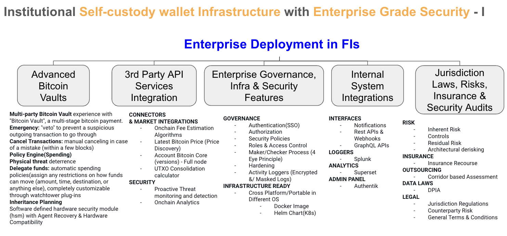
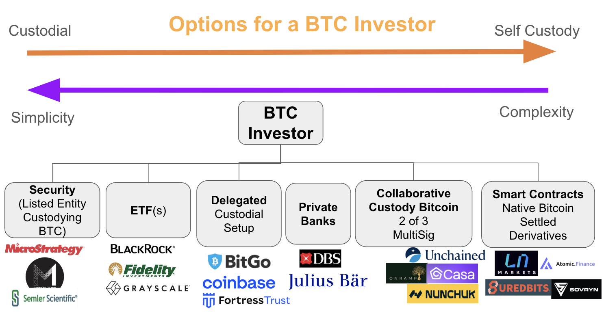

# OpenVault
OpenVault is a platform for securely managing keys to Bitcoin wallets for Enterprises (self, clients). It is a white-labelled Bitcoin based Enterprise Custody Wallet core banking solution in the Bitcoin Standard for traditional banks to upgrade their Infra to offer their Clients different risk profile of Bitcoin Custody. OpenVault provides a unified interface to any key, while providing tight access control and recording a detailed audit log. 

OpenVault Multisig Node Suite is a fully privatized white-label solution, enabling you to securely, efficiently, and at scale build applications based on Multi-Sig Bitcoin wallets. Experience seamless integration into your applications. As a privatized solution featuring server-side Multi-sig Node middleware and SDKs for browsers, Android, and iOS, it offers a unified set of functions, interfaces, and integration processes. Quickly develop your Bitcoin wallet applications while maintaining full data ownership and privacy. 

A enterprise custody system requires policies and access control to understand who in the org is enbling what keys are being re-generated in a zero knowledge fashion for clients. Adding on key rolling, secure storage, and detailed audit logs is almost impossible without a custom solution. Mostly all enterprise custody wallet solution providers like BitGo, Coinbase, Bakkt and Fortress have their respective pproprietary custom solutions. This is where OpenVault steps in to create a FOSS based open platform.

Support diverse business scenarios to accelerate your success
       1. Keyless Wallets (Target Customer: Wallet Service Provider)
       2. Financial Platform (Target Customer: Exchanges/Payment Service Providers)
       3. Self Custody Service Provider (Target Customer: Banks/Financial Institutions)
       4. Cold Wallet Solution (Target Customer: Corporates looking for Self Treasury Solutions) - OpenVault allows any small business, mid-market, or enterprise to seamlessly store, transact, and manage their Bitcoin Treasury.

# Why OpenVault
Build a vault standard easily accessible for all Banks to upgrade Infrastructure to upgrade their capability to offer Bitcoin Custodial Services to their Clients in their existing Infrastructure. The vision is to become the core banking backend for Bitcoin Custody in the Bitcoin Standard in comparison to Traditional banks using like [Finacle](https://www.edgeverve.com/finacle/), [Temenos](https://www.temenos.com/), [Avaloq](https://www.avaloq.com/), [Apache Fineract](https://github.com/apache/fineract)

# OpenVault Offerings
       1. Dependency/Inspiration on other FOSS projects
              a. WALLET: [Liana](https://github.com/wizardsardine/liana)
              b. VAULT: [Revault](https://github.com/revault/revaultd)
              c. WALLET: [Caravan](https://github.com/unchained-capital/caravan)
              d. ADMIN PANEL: [Authentik](https://github.com/goauthentik/authentik)
       2. Product Features
              a. Direct Bitcoin Custody
              b. Onchain Inheritance for Generational Wealth Transfer
              c. BUM Audit - Bitcoin Under Management Independent Audit (proof of reserves)
              d. Compatability with latest Hardware Wallet Providers (Flexibility of HSMs without using HSMs: Software defined HSMs)
              e. Education Kit on Security Posture and best practices
              f. Technical Insurance/Disaster recovery: Build Recovery pathways (Expanding or Contracting Multi-Sig)
                    i. The lockup period is enforced onchain by the Bitcoin network. This is achieved by leveraging timelock capabilities of Bitcoin smart contracts (Script).
                    ii. OpenVault gives trustless inheritance, loss protection or safer backups
                    iii. 
              g. Hot & Cold Wallets interoperability: A fully decentralized, air-gapped cold wallet solution guarantees you control key shard distribution, providing the utmost security for your businesses.
              h. Policy Engine: Support Txn thresholds based on hierarchy and role of signing authority
              i. Transaction Approval Workflows: Build your own transaction policy engine using the Presigned Transactions Node Suite to serve your enterprise customers, enabling multi-party transaction approvals to facilitate secure control and governance of multiple keys in multi-sign scheme. 
              j. Enterprise-grade self-custody through private deployment
       3. Technical Features    
              a. Setup vaults for your clients [Individual vs Family vs Institutional]
              b. Purpose based Vaults (multiple configurations)
              c. Vault Configurations: Multi-sig Wallet Setup Options [Custodial, Collaborative vs Non-Custodial]
              d. Easily Integrate with On Prem / SaaS based e-banking solutions of Banks
                  a. Multiple Protocol Mediations/DataExchange: RestAPI/GraphAPI/Webhooks/RPCs
                  b. Air gapped Containerized deployments: DockerCompose/K8 HelmCharts/ K8s Operators
                  c. Rolebased Access Control Integration Support: AWS IAMCore / Azure EntraID or ADFS / Google
                  d. Logging & Piping to Enterprise Loggers: 
                  e. Admin Panel to manage Ops from internal employees

# Overall Components


# Overall Options of Product Offering for a BTC Investor


# Overall Architecture 

```mermaid
flowchart TD
%% High-Level Components
    A("User Interface")
    B["Authentication Service"]
    C["Secure Vault Management"]
    D("fa:fa-database Key Storage")
    E["fa:fa-btc Bitcoin Node"]
    F("fa:fa-clipboard File Storage")
    G("fa:fa-network-wired Network Service")
    H["fa:fa-shield-alt Watchtower"]
    I("fa:fa-desktop Monitoring and Logging")
    J("fa:fa-users Admin Panel")
    K("fa:fa-key Multi-Factor Authentication")
    L("fa:fa-spinner Initialization & Setup")
    M("fa:fa-tools Maintenance")
    N("fa:fa-cogs Configuration Management")
    O("fa:fa-lock Role-Based Access Control")
    P("fa:fa-exchange-alt Transaction Coordinator")
    Q("fa:fa-hourglass Job Scheduling")
    R("fa:fa-server Hardware Security Module (HSM)")
    S("fa:fa-user-shield Governance & Policy Engine")
    T("fa:fa-wallet Multisig Management")
    U("fa:fa-edit Multisig Wallet Setup")
    V("fa:fa-share-alt Transaction Builder")
    W("fa:fa-certificate Signature Aggregator")
    X("fa:fa-key Signing Devices")

%% High-Level Edge Connections
    A -->|Authenticate| B
    B -->|Two-Factor| K
    B -->|Validate| O
    O -->|Access| C
    C -->|Coordinate| P
    C -->|Access| D
    C -->|Sync| E
    C -->|Store Files| F
    C -->|Broadcast| G
    C -->|Encrypt| H
    H -->|Secure Channel| C
    D -->|Backup Keys| F
    G -->|Broadcast| E
    E -->|Update| G
    C -->|Log Events| I
    J -->|Manage| C
    K -->|Two-Factor| B
    L -->|Setup Environment| C
    M -->|Update| C
    N -->|Configure| C
    P -->|Coordinate Jobs| Q
    Q -->|Job Execution| C
    S -->|Policy Enforcement| C
    C -->|Manage Secure Keys| R
    C -->|Create Multisig Wallet| U
    U -->|Manage Multisig| T
    T -->|Build Transactions| V
    V -->|Aggregate Signatures| W
    W -->|Sign with Devices| X
    X -->|Verify Signatures| W
    W -->|Send Signed Transaction| V
    V -->|Broadcast| G

%% Detailed Subcomponents of "Secure Vault Management"
    subgraph Secure_Vault_Management
        C["Secure Vault Management"]

        C1["Access Control"]
        C2["Multisig Coordinator"]
        C3["Transaction Manager"]
        C4["Key Manager"]
        C5["Policy Engine"]
        C6["State Manager"]
        C7["Communication Manager"]

        C --> C1
        C --> C2
        C --> C3
        C --> C4
        C --> C5
        C --> C6
        C --> C7

        C1a["Role-Based Access Control (RBAC)"]
        C1b["Permission Management"]
        C1c["Authentication Gateway"]

        C1 --> C1a
        C1 --> C1b
        C1 --> C1c

        C2a["Multisig Wallet Setup"]
        C2b["Signature Verification"]
        C2c["Address Derivation"]

        C2 --> C2a
        C2 --> C2b
        C2 --> C2c

        C3a["Transaction Builder"]
        C3b["Transaction Broadcaster"]
        C3c["UTXO Management"]
        C3d["Fee Estimation"]

        C3 --> C3a
        C3 --> C3b
        C3 --> C3c
        C3 --> C3d

        C4a["Key Generation"]
        C4b["Key Storage"]
        C4c["Key Rotation"]
        C4d["Key Backup/Restore"]

        C4 --> C4a
        C4 --> C4b
        C4 --> C4c
        C4 --> C4d

        C5a["Governance Rules"]
        C5b["Policy Evaluation"]
        C5c["Threshold Management"]

        C5 --> C5a
        C5 --> C5b
        C5 --> C5c

        C6a["State Persistence"]
        C6b["State Recovery"]
        C6c["State Monitoring"]

        C6 --> C6a
        C6 --> C6b
        C6 --> C6c

        C7a["Secure Messaging"]
        C7b["Network Protocols"]
        C7c["Channel Encryption"]

        C7 --> C7a
        C7 --> C7b
        C7 --> C7c
    end

%% Styling for high-level components
    style B color:#FFFFFF, fill:#2962FF, stroke:#2962FF
    style C color:#FFFFFF, fill:#00C853, stroke:#00C853
    style D color:#FFFFFF, fill:#FF7043, stroke:#FF7043
    style E color:#FFFFFF, fill:#FBC02D, stroke:#FBC02D
    style F color:#FFFFFF, fill:#7E57C2, stroke:#7E57C2
    style G color:#FFFFFF, fill:#0288D1, stroke:#0288D1
    style H color:#FFFFFF, fill:#D32F2F, stroke:#D32F2F
    style O color:#FFFFFF, fill:#FFEB3B, stroke:#FFEB3B
    style P color:#FFFFFF, fill:#795548, stroke:#795548
    style Q color:#FFFFFF, fill:#009688, stroke:#009688
    style R color:#FFFFFF, fill:#1E88E5, stroke:#1E88E5
    style S color:#FFFFFF, fill:#8E24AA, stroke:#8E24AA
    style T color:#FFFFFF, fill:#00897B, stroke:#00897B
    style U color:#FFFFFF, fill:#FFD600, stroke:#FFD600
    style V color:#FFFFFF, fill:#F57C00, stroke:#F57C00
    style W color:#FFFFFF, fill:#689F38, stroke:#689F38
    style X color:#FFFFFF, fill:#C2185B, stroke:#C2185B

%% Styling for Secure Vault Management Subcomponents
    style C1 fill:#E6E6FA,stroke:#333,stroke-width:2px
    style C2 fill:#E0FFFF,stroke:#333,stroke-width:2px
    style C3 fill:#FFFACD,stroke:#333,stroke-width:2px
    style C4 fill:#F0FFF0,stroke:#333,stroke-width:2px
    style C5 fill:#FAEBD7,stroke:#333,stroke-width:2px
    style C6 fill:#FFE4E1,stroke:#333,stroke-width:2px
    style C7 fill:#F5F5F5,stroke:#333,stroke-width:2px
```



### Mermaid Version for Reference
```mermaid
  info
```
# Security
See SECURITY.md for details about reporting a security vulnerability or any bug that could potentially impact the security of users' funds.

# License
Released under the BSD 3-Clause Licence. See the LICENSE.md file.

# Contributing
 See CONTRIBUTING.md for details about contributing to the FOSS project. 

# Hacking on OpenVault

## GUI

## BE

## Containerization

