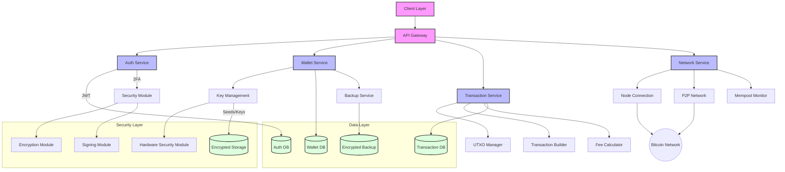

# Architectural components of Specter Desktop:

### Core Components
Python-based architecture
Flask web framework
Bitcoin Core RPC integration
Device and wallet management

### Device Manager
Hardware Wallet Interface (HWI)
Device detection and communication
Support for multiple hardware wallets
Key extraction and management

### PSBT Handling
Transaction signing coordination
Hardware wallet communication protocols
Key verification

### Wallet Manager
#### Multiple Wallet Types
 - Single signature wallets
 - Multisignature wallets (n-of-m)
 - Watch-only functionality

#### Transaction Management
 - UTXO tracking
 - Address generation
 - Transaction composition
 - PSBT coordination

### Bitcoin Core Interface

#### RPC Communication
 - Direct Bitcoin Core integration
 - Transaction broadcasting
 - Block data retrieval

#### Node Management
 - Connection handling
 - Blockchain synchronization
 - Network status monitoring

### Web Interface (Flask)

#### Backend Services
 - REST API implementation
 - User authentication
 - Session management

#### Frontend
 - Responsive web interface
 - JavaScript-based interaction
 - Real-time updates

### Storage Layer
#### File-based Storage
 - JSON configuration files
 - Device information
 - Wallet data
 - User preferences

## Key Technical Features:

### Security Architecture
Air-gapped signing support
Multisignature coordination
Watch-only wallet capability
Deterministic builds

### Integration Capabilities
Bitcoin Core dependency
HWI for hardware wallet support
External tool integration

### Design Patterns
MVC architecture in Flask
Event-driven device communication
Repository pattern for storage

### Notable Characteristics

Emphasis on privacy
Focus on cold storage
Multisig-first approach
Self-hosted solution

## Implementation Details:

### Core Technologies
Python (primary language)
Flask (web framework)
Bitcoin Core RPC
SQLite (where needed)
JavaScript (frontend)

### Communication Flow
REST APIs for client-server interaction
WebSocket for real-time updates
RPC for Bitcoin Core communication

### Security Considerations
Local-only web interface
Encryption of sensitive data
Secure key handling
Authentication mechanisms

