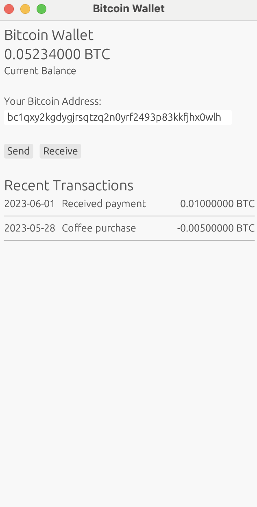

## To run the app:

$ cd mvps/egui_mobileresponsive

```
cargo run --example native
```

## Gui Screesnhot reference:



## About the App:
A more realistic Bitcoin wallet-like interface with responsive design. It demonstrates:
1. Adapting layouts for different screen sizes.
2. Displaying financial information (balance and transactions).
3. Basic wallet functionality structure (send/receive buttons).
4. Using egui's layout system for more complex UIs.
